

  <picture>
    <source media="(prefers-color-scheme: dark)" srcset="assets/img/screenshots/dark_01_home.png" width="120">
    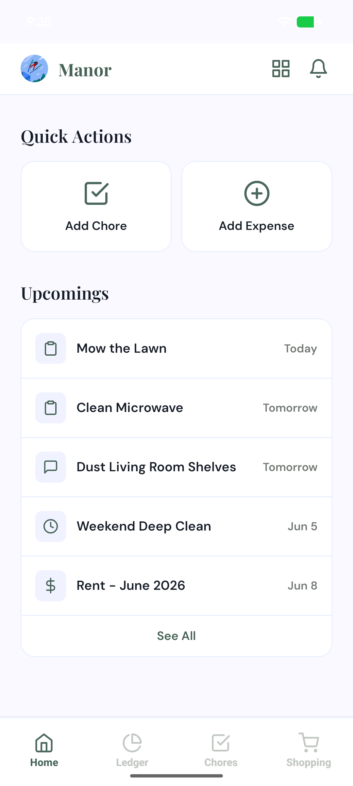
  </picture>

<h1 align="center">Manor</h1>

<strong>Manage Shared Living — Effortlessly.</strong>

  
  
  
  

---

Living with others is great — managing the logistics isn't. Manor replaces the chaos of group chats, physical whiteboards, and scattered payment requests with a single, elegant source of truth.

Built for **roommates, couples, and families** who want less friction and more harmony at home.

## Features

<table>
<tr>
<td width="33%" align="center">
  <h3>Smart Ledger</h3>
  
Track every shared expense. Manor automatically calculates who owes whom — settle up with a single tap. No more spreadsheets or awkward money conversations.

</td>
<td width="33%" align="center">
  <h3>Chore Management</h3>
  
Assign tasks, set deadlines, earn points. Renegotiate deadlines and points directly in-app. No more nagging — just tap and done.

</td>
<td width="33%" align="center">
  <h3>Shared Shopping</h3>
  
Real-time synced list for your household. Buy an item and instantly split its cost into the Ledger. Never double-buy milk again.

</td>
</tr>
</table>

## App Showcase

### Light Theme

| Home | Shopping | Ledger |
|:---:|:---:|:---:|
|  | 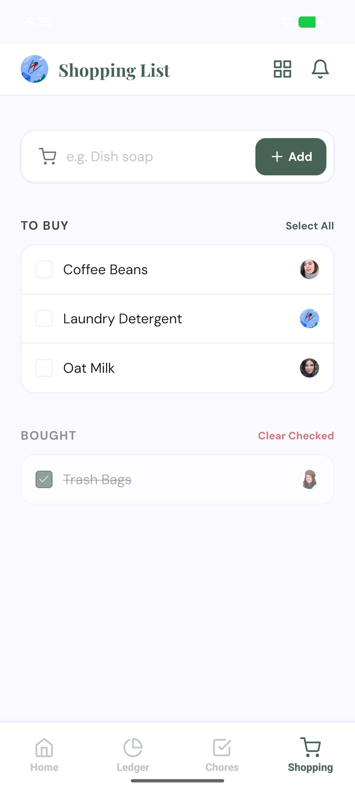 | 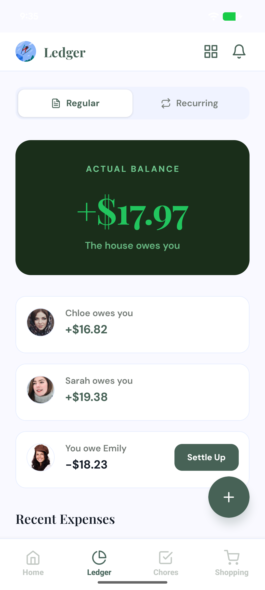 |

| Chores | The Hub | Settings |
|:---:|:---:|:---:|
| 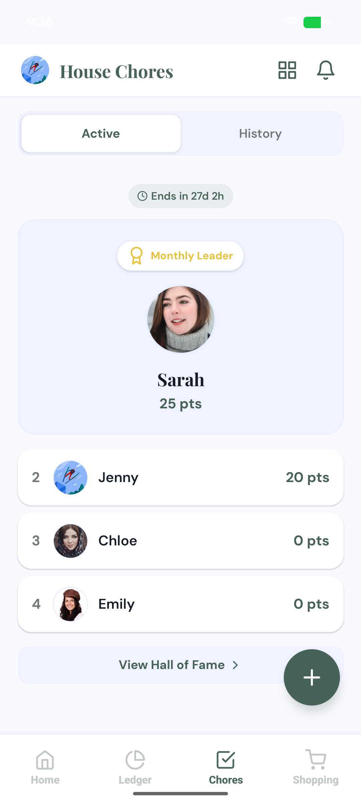 | 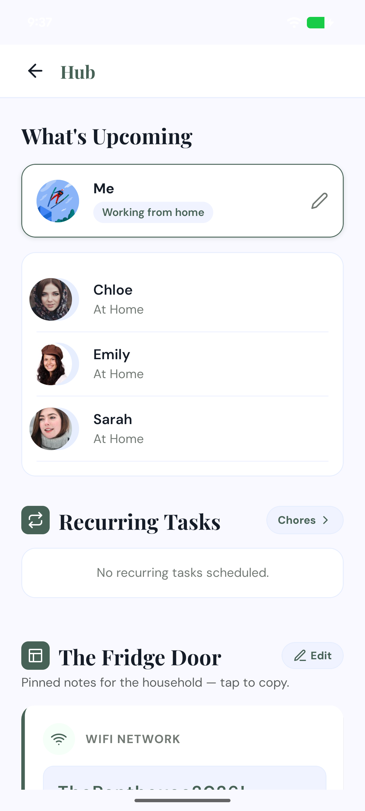 | 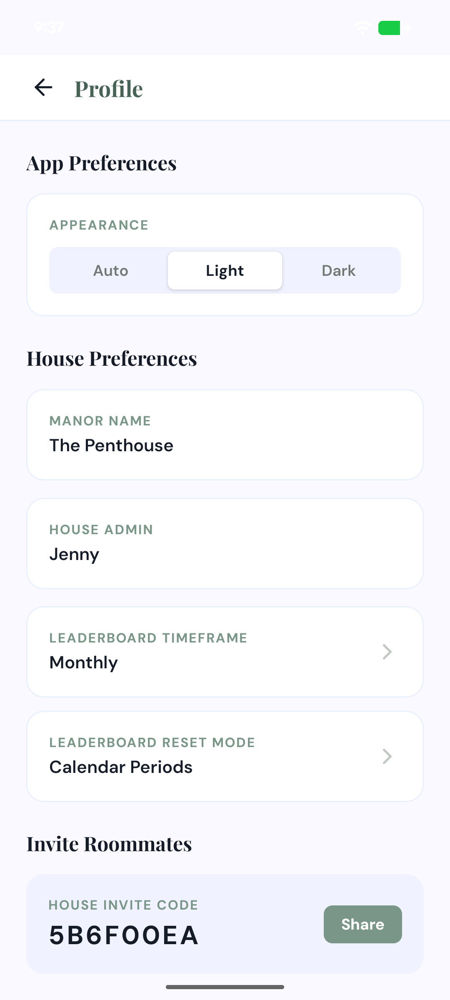 |

### Dark Theme

| Home | Shopping | Ledger |
|:---:|:---:|:---:|
| 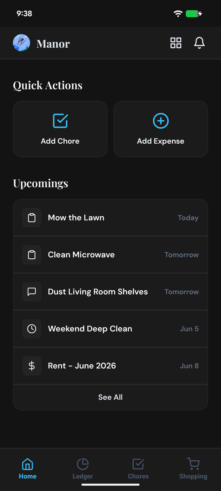 | 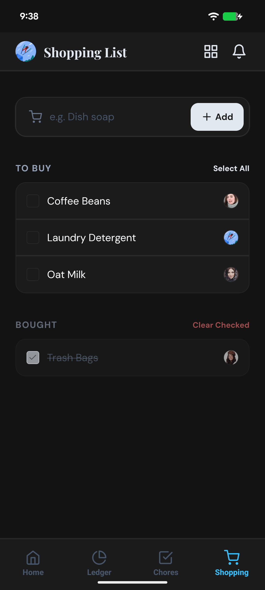 | 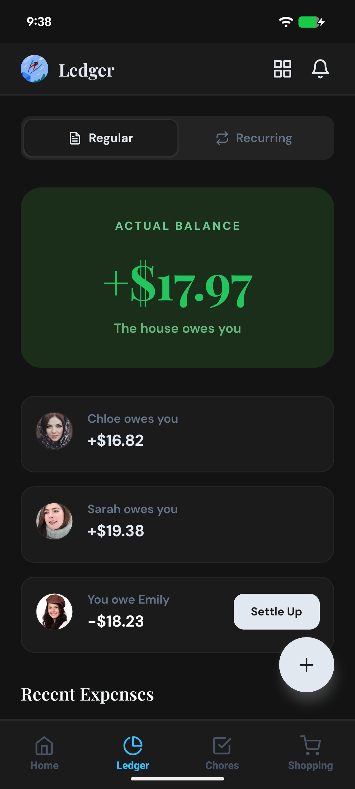 |

| Chores | The Hub | Settings |
|:---:|:---:|:---:|
| 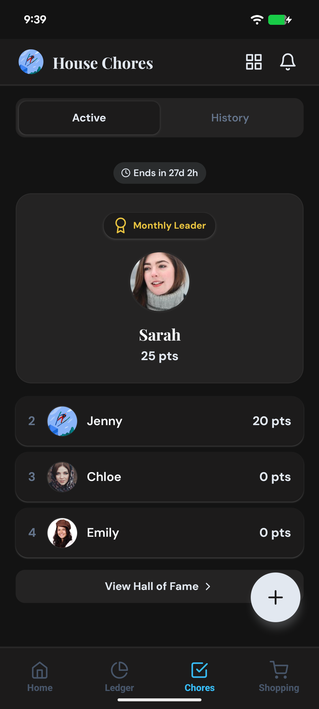 | 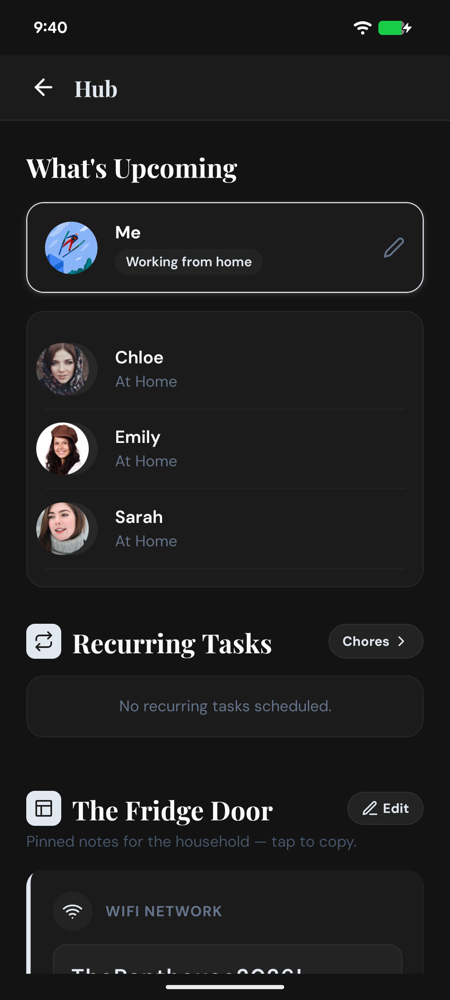 | 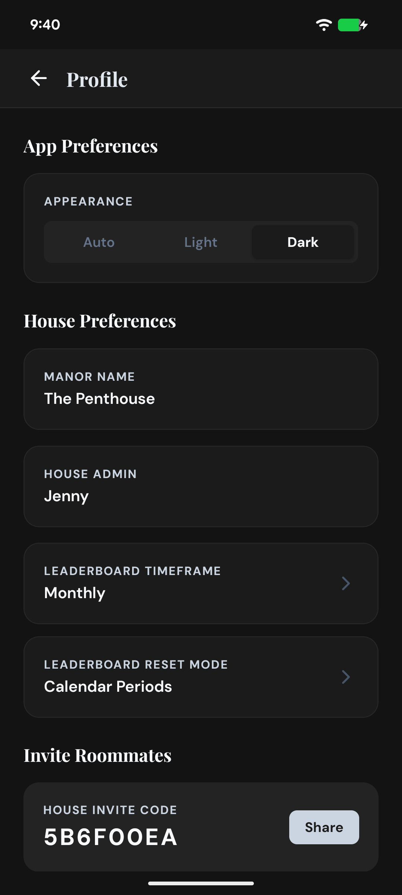 |

## Join the Community

We're building Manor in the open, and your voice shapes what we build next. Pick your favorite platform:

| Platform | Best for | |
|:---|:---|---:|
| **Discord** | Quick bug reports, casual chats | [Join →](https://discord.gg/J4cp3aukYS) |
| **Reddit** | Voting on features, longer discussions | [r/manorApp →](https://www.reddit.com/r/manorApp/) |
| **GitHub** | Detailed reports, tracking our roadmap | [Discussions →](https://github.com/arboraistudio/manor-home/discussions) |

---

  Built by <a href="https://arboraistudio.com">Arbor AI Studio</a> &nbsp;·&nbsp; <a href="https://manor.arboraistudio.com">Website</a> &nbsp;·&nbsp; <a href="https://manor.arboraistudio.com/privacy/">Privacy Policy</a>

